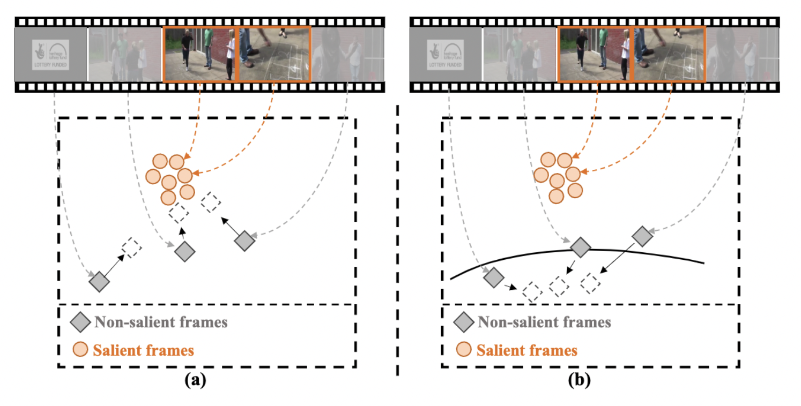

<!-- This paper is about the number 1. The number 2 is left for future work. -->
<!-- 
 -->
<!-- 
 --> 

European Conference on Computer Vision (ECCV) 2022

    <a href="https://lawrencexia2008.github.io" target="_blank">Boyang Xia</a>1*,&nbsp;&nbsp;
    <a href="https://whwu95.github.io">Wenhao Wu</a>2,3$\dagger$*,&nbsp;
    <a href="#">Haoran Wang</a>3,&nbsp;
    <a href="#">Rui Su</a>4,&nbsp;
    <a href="#">Dongliang He</a>4,&nbsp;
    <a href="#">Haosen Yang</a>5,&nbsp;
    <a href="#">Xiaoran Fan</a>1,&nbsp;
    <a href="https://wlouyang.github.io" target="_blank">Wanli Ouyang</a>4,3&nbsp;

<!-- [Download paper here](http://academicpages.github.io/files/paper1.pdf) -->

1Institute of Computing Technology &nbsp;
2The University of Sydney&nbsp;
3Shanghai AI Laboratory  
4Baidu Inc. &nbsp;
5Harbin Institute of Technology

    <a href="https://lawrencexia2008.github.io/projects/nsnet">Webpage</a> | <a href="https://lawrencexia2008.github.io/projects/nsnet">Paper</a>

 

<!--  -->

To accelerate the video recognition architectures, one typically build a lightweight video key frame sampler to firstly sample a few salient frames and then evoke a recognizer on them, to reduce temporal redundancies. However, existing methods neglect the discrimination between non-salient frames and salient ones in training objectives. We introduced a novel multi-granularity supervision scheme to suppress the non-salient frames and achieved SOTA accuracy with very low GFLOPs and wall-clock time (*$4\times$* faster than SOTA methods) on 4 video recognition benchmarks. 

<!-- Recommended citation: Your Name, You. (2009). "Paper Title Number 1." <i>Journal 1</i>. 1(1). -->