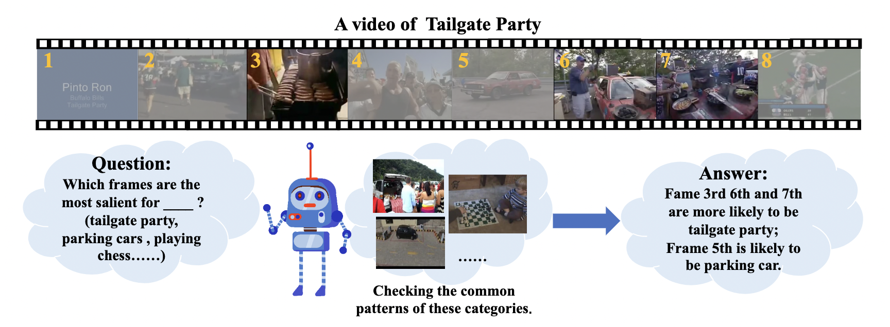

<!-- This paper is about the number 1. The number 2 is left for future work. -->
<!-- 
 -->
<!-- 
 --> 

European Conference on Computer Vision (ECCV) 2022

    <a href="https://lawrencexia2008.github.io" target="_blank">Boyang Xia</a>1,2*,&nbsp;
    <a href="#">Zhihao Wang</a>1,2*,&nbsp;
    <a href="https://whwu95.github.io">Wenhao Wu</a>3,4$\dagger$,&nbsp;
    <a href="#">Haoran Wang</a>3,&nbsp;
    <a href="#">Jungong Han</a>5,&nbsp;

<!-- [Download paper here](http://academicpages.github.io/files/paper1.pdf) -->

1Institute of Computing Technology, Chinese Academy of Sciences  
2University of Chinese Academy of Sciences  
3The University of Sydney &nbsp;   
4Baidu Inc. &nbsp;
5Aberystwyth University

    <a href="https://lawrencexia2008.github.io/projects/tsqnet">Code</a> | <a href="https://arxiv.org/abs/2207.10379">Paper</a>

 

A human can precisely elect the most informative frames with the aid of prior knowledge about the probable category
of the video. Inspired by this intuition, we pioneeringly cast frame sampling as a query-response task to introduce category prior knowledge from both visual and textual modalities in temporal sampling framework. Experimental results show the efficacy of our method on both and practical speed.

<!-- Recommended citation: Your Name, You. (2009). "Paper Title Number 1." <i>Journal 1</i>. 1(1). -->